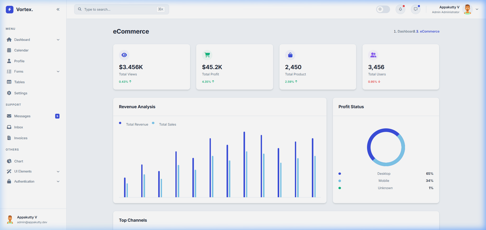
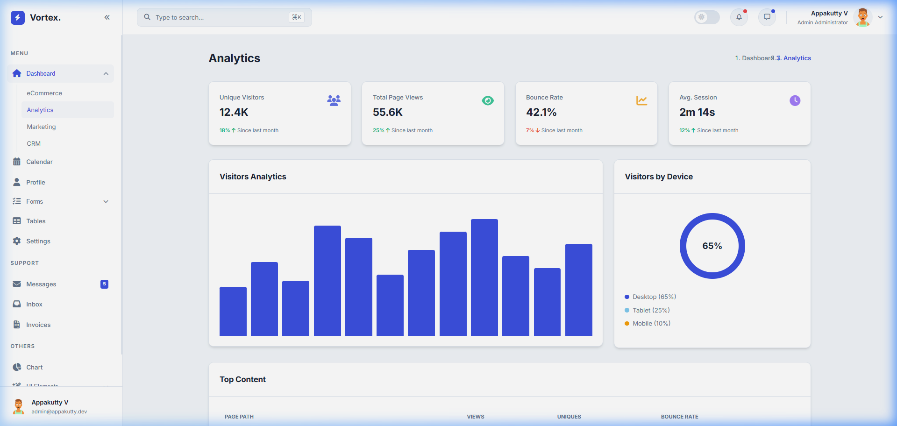
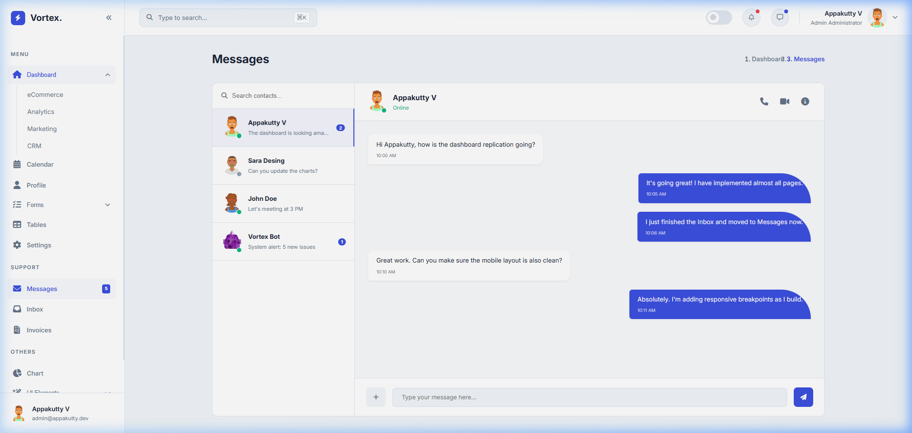

# 📊 Vortex Business Dashboard


A premium, high-fidelity **Business Dashboard** template built with **Angular 17+**. Designed for scale, performance, and a stunning user experience.

---

## 🚀 Vision
**Vortex** is more than just a dashboard; it's a comprehensive design system and architecture designed to bypass gravity and launch your SaaS product into orbit. It follows the **TailAdmin** design philosophy with a custom **Indigo-Slate** palette.

---

## ✨ Features

*   📈 **Multi-Dashboard Support**: specialized views for eCommerce, Analytics, Marketing, and CRM  
*   🌓 **Advanced Theme Engine**: Persistent Light/Dark mode switching powered by Angular Signals  
*   📅 **Interactive Calendar**: Full-featured monthly event management grid  
*   💬 **Communication Suite**: Professional Inbox and real-time Chat interfaces  
*   🧩 **Modular Architecture**: Strict Core/Shared/Features directory structure  
*   📱 **True Responsive Design**: Fluid layouts for Desktop, Tablet, and Mobile  
*   🤖 **Automated CI/CD**: One-click deployment to GitHub Pages via Actions  

---

## 🛠️ Tech Stack

*   **Frontend**: Angular 17+ (Standalone Components)  
*   **Styling**: Vanilla CSS (TailAdmin Design Tokens)  
*   **Icons**: FontAwesome 6 (Solid/Regular/Brands)  
*   **Deployment**: GitHub Actions + GitHub Pages  

---

## 🤖 Tools & Inspiration

- **ChatGPT** — provided development guidance, coding suggestions, and documentation assistance.
- **Google Antigravity** — inspired the creative “bypass gravity” theme and launch-style prompts.

---

## 📂 Project Structure

```bash
business-dashboard/
│── frontend/        # Angular standalone application
│── backend/         # API logic & services (.gitkeep placeholder)
│── assets/          # Static media & resources (.gitkeep placeholder)
│── docs/            # Project documentation & walkthroughs (.gitkeep placeholder)
└── README.md
```

> ⚠️ **Notes**: `backend/`, `assets/`, and `docs/` currently contain only `.gitkeep` as placeholders for Git tracking.

---

## 📸 Screenshots

### Dashboard Overview


### Analytics Deep-Dive


### Messages & Mobile Responsive


---

## ⚙️ Quick Start

### 1. Installation
```bash
git clone https://github.com/appakuttyv/business-dashboard.git
cd business-dashboard/frontend
npm install
```

### 2. Development Mode
```bash
ng serve
```
Open `http://localhost:4200` to see the dashboard in action.

**Note**: Angular 17 requires **Node 20+**.

---

## 🔒 Access Notice
This repository is for **view-only purposes**. Unauthorized contributions or usage are not permitted.

---

## 👨‍💻 Author
**Appakutty V**  
*Lead Architect & Developer*

---

## 📜 Documentation
Check the [Full Project Walkthrough](docs/walkthrough.md) for a detailed technical breakdown and feature showcase.

---

## 🚀 Antigravity Launch

You can use this PowerShell snippet to reset or initialize the project modules:

```powershell
Write-Host "🚀 Initiating Vortex launch sequence... 🪂" -ForegroundColor Cyan
$folders = @("backend","assets","docs")
foreach ($f in $folders) {
    if (-Not (Test-Path $f)) { mkdir $f }
    Set-Content -Path "$f/.gitkeep" -Value "# Placeholder to track empty folder"
    Write-Host "✨ $f ready with .gitkeep for Git tracking"
}
git add .
git commit -m "Add empty folders with .gitkeep"
git push origin main
Write-Host "🌟 All folders deployed successfully! Gravity defeated. 🚀" -ForegroundColor Green
```
